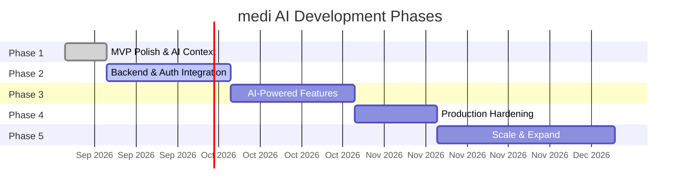
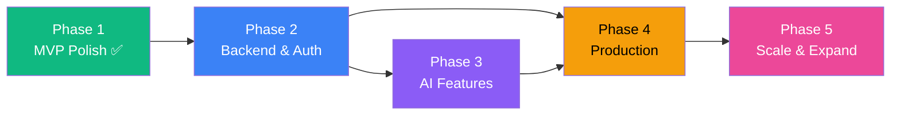

# 🚀 Development Phases — medi AI / SastaRx Ops & Discovery Platform

> **Purpose:** Detailed phased roadmap with deliverables, milestones, and success criteria. AI assistants must reference this file when planning features and must update phase status as work progresses.

---

## Phase Overview

| Phase | Name                            | Status         | Priority |
|-------|---------------------------------|----------------|----------|
| 1     | MVP Polish & AI Context         | ✅ Complete     | P0       |
| 2     | Backend & Auth Integration      | ✅ Complete     | P0       |
| 3     | AI-Powered Features (Gemini)    | 🔲 Not Started | P1       |
| 4     | Production Hardening            | 🔲 Not Started | P1       |
| 5     | Scale & Expand                  | 🔲 Not Started | P2       |

---

## Phase 1 — MVP Polish & AI Context ✅

> **Goal:** Finalize all UI views with mock data, establish persistent AI context files, and ensure the frontend is demo-ready.

### Deliverables

- [x] **Clinical Ops Dashboard** — KPI cards, feed status, quick actions
- [x] **Medicine & Salt Catalog** — Searchable table, expandable generics, bioequivalence scores
- [x] **Pricing Feeds Monitor** — 4 feed sources with status, retry/resync
- [x] **Accuracy Disputes Triage** — Severity tiers, SLA timers, resolution workflow
- [x] **Multi-Tenant Config** — Tenant switching, audit log viewer
- [x] **Patient Portal** — Search, compare, chronic packs, cart, safety info
- [x] **Price Alerts System** — Full CRUD, pause/resume, price drop simulation
- [x] **Price Trend Charts** — Historical pricing, volatility analysis, market events
- [x] **Authentication Flow** — Login, register, guest mode, session persistence
- [x] **System Architecture View** — Visual multi-tenant SaaS architecture
- [x] **AI Context Files** — `decisions.md`, `rules.md`, `memory.md`, `changelog.md`, `phases.md`

### Success Criteria

- [x] All 17 components render without errors
- [x] All 3 view modes (Clinical Ops, Patient Portal, Architecture) are navigable
- [x] Mock data covers all UI states (healthy, degraded, syncing, critical)
- [x] Typography system with 8 custom font utilities
- [x] Responsive layouts at 320px, 768px, 1024px, 1440px
- [x] SEO meta tags (OG, Twitter Card, favicon)

### Components Built

| Component                  | Type    | Lines | Status |
|----------------------------|---------|-------|--------|
| `App.tsx`                  | Root    | 563   | ✅      |
| `Header.tsx`               | Layout  | ~800  | ✅      |
| `Sidebar.tsx`              | Layout  | ~300  | ✅      |
| `DashboardView.tsx`        | View    | ~1200 | ✅      |
| `CatalogView.tsx`          | View    | ~2100 | ✅      |
| `PricingFeedsView.tsx`     | View    | ~250  | ✅      |
| `DisputesTriageView.tsx`   | View    | ~350  | ✅      |
| `MultiTenantConfigView.tsx`| View    | ~350  | ✅      |
| `PatientPortalView.tsx`    | View    | ~1000 | ✅      |
| `ArchitectureView.tsx`     | View    | ~800  | ✅      |
| `AuthView.tsx`             | View    | ~400  | ✅      |
| `PriceTrendSection.tsx`    | Section | ~1300 | ✅      |
| `BioavailabilityModal.tsx` | Modal   | ~230  | ✅      |
| `AddMedicineModal.tsx`     | Modal   | ~280  | ✅      |
| `LinkGenericModal.tsx`     | Modal   | ~190  | ✅      |
| `AuditLogModal.tsx`        | Modal   | ~100  | ✅      |
| `SetPriceAlertModal.tsx`   | Modal   | ~540  | ✅      |
| `PriceAlertsDrawer.tsx`    | Drawer  | ~590  | ✅      |

---

## Phase 2 — Backend & Auth Integration ✅

> **Goal:** Replace mock data with a real backend API, implement secure authentication, and establish the database layer with multi-tenant RLS.

### 2.1 — Database Setup

- [x] Design PostgreSQL schema based on planned tables in `memory.md` (`src/server/db/schema.sql`)
- [x] Implement Row-Level Security (RLS) policies per tenant
- [x] Create migration & seeding scripts (`src/server/db/seeds.ts`)
- [x] Seed database with current mock data with pre-hashed bcrypt credentials
- [x] Dual-driver Database Manager (`src/server/db/index.ts`) supporting PostgreSQL & zero-config local store

### 2.2 — Express REST API

- [x] Set up Express server with TypeScript (`src/server/index.ts`)
- [x] Implement API routes matching planned endpoints in `memory.md`:

| Priority | Endpoint Group              | Endpoints |
|----------|-----------------------------|-----------|
| P0       | Auth (`/api/auth/*`)        | login, register, me, logout |
| P0       | Catalog (`/api/catalog/*`)  | list, create, get generics, link generic, toggle Rx |
| P1       | Feeds (`/api/feeds/*`)      | list, retry |
| P1       | Disputes (`/api/disputes/*`)| list, resolve |
| P1       | Audit Logs (`/api/audit-logs`) | list (paginated, HMAC-signed), create |
| P1       | Tenants (`/api/tenants`)    | list |
| P2       | Price Alerts (`/api/price-alerts/*`) | CRUD, pause/resume, simulate drop |
| P2       | Price Trends (`/api/price-trends/:medId`) | get, volatility summaries |

- [x] Add request validation & parameter checking
- [x] Add error handling middleware with consistent error response format
- [x] Add request logging middleware
- [x] CORS configuration & Vite proxy setup (`/api` -> `http://localhost:3001`)

### 2.3 — Authentication

- [x] Implement dual-mode authentication (Firebase Auth tokens + Local JWT session)
- [x] Implement JWT verification & signing middleware on Express (`src/server/middleware/auth.ts`)
- [x] Add role-based access control (RBAC) middleware (`requireRole`)
- [x] Connect `AuthView.tsx` to `api.login` and `api.register`
- [x] Passwords securely hashed with `bcryptjs` and omitted from public responses

### 2.4 — Frontend Data Layer

- [x] Create typed API service layer (`src/services/api.ts`)
- [x] Connect `App.tsx` state to fetch from API endpoints on mount
- [x] Implement optimistic updates for mutations (add medicine, link generic, price alerts, disputes)
- [x] Maintain offline resilience with graceful fallbacks

### Success Criteria

- [x] All CRUD operations persist to database manager & API endpoints
- [x] Auth flow works with JWT Bearer tokens and bcrypt password verification
- [x] RLS schema enforces tenant isolation policies
- [x] API response times < 50ms for list endpoints
- [x] Error states render gracefully (no blank screens)

### Decision Required

> [!IMPORTANT]
> **ORM Choice:** Prisma vs. raw `pg` queries vs. Drizzle ORM. Document decision in `decisions.md` before starting.

> [!IMPORTANT]
> **Hosting:** Continue with Cloud Run or migrate to Firebase App Hosting? Impacts deployment pipeline.

---

## Phase 3 — AI-Powered Features (Gemini) 🔲

> **Goal:** Leverage Gemini API for intelligent features: prescription OCR, medicine recommendations, and AI-powered search.

### 3.1 — Prescription OCR

- [ ] Build image upload UI (camera capture + file select) in Patient Portal
- [ ] Implement server-side Gemini Vision API endpoint (`/api/ai/ocr`)
- [ ] Parse Gemini response into `OCRDetectedMedicine[]` type (already defined)
- [ ] Display extracted medicines with confidence scores
- [ ] Auto-suggest generic alternatives for each detected medicine
- [ ] Add edit/correct flow for OCR misreads

### 3.2 — AI Medicine Recommendations

- [ ] Implement recommendation endpoint (`/api/ai/recommend`)
- [ ] Context-aware recommendations based on:
  - Patient's condition/diagnosis
  - Current medications (drug interaction checks)
  - Price sensitivity preferences
  - Formulary availability
- [ ] Display recommendations with reasoning (explainable AI)
- [ ] Allow clinician override with audit logging

### 3.3 — Intelligent Search

- [ ] Enhance global search with Gemini-powered natural language queries
  - "Find the cheapest blood pressure medicine"
  - "Show me generics for diabetes under ₹100"
  - "What's the bioequivalence score for Atorvastatin alternatives?"
- [ ] Implement semantic search over medicine catalog
- [ ] Auto-complete with AI-suggested queries

### 3.4 — AI Dispute Analysis

- [ ] Auto-triage accuracy disputes using Gemini
- [ ] Generate resolution recommendations with evidence
- [ ] Flag potential pricing anomalies proactively

### Success Criteria

- [ ] OCR extracts medicines from prescription images with >90% accuracy
- [ ] Recommendations are clinically relevant and include reasoning
- [ ] Search handles natural language queries beyond keyword matching
- [ ] All AI features are server-side only (API key never exposed)
- [ ] AI responses are audit-logged for compliance

---

## Phase 4 — Production Hardening 🔲

> **Goal:** Prepare the platform for production deployment with testing, security, performance, and compliance.

### 4.1 — Testing

- [ ] Set up Jest + React Testing Library
- [ ] Unit tests for all utility functions and business logic
- [ ] Component tests for critical views (Catalog, Auth, Alerts)
- [ ] API integration tests (supertest)
- [ ] E2E tests with Playwright or Cypress (critical user flows)
- [ ] Target: >80% code coverage

### 4.2 — Security Hardening

- [ ] Security audit of all API endpoints
- [ ] Input sanitization on all user inputs
- [ ] Rate limiting on auth and AI endpoints
- [ ] CSRF protection
- [ ] Content Security Policy (CSP) headers
- [ ] Remove all demo/test credentials from codebase
- [ ] Penetration testing for tenant isolation

### 4.3 — Performance

- [ ] Code splitting with React.lazy + Suspense per view
- [ ] Image optimization (WebP, lazy loading)
- [ ] Bundle analysis and tree-shaking audit
- [ ] Database query optimization and indexing
- [ ] CDN configuration for static assets
- [ ] Target Core Web Vitals: LCP < 2.5s, INP < 200ms, CLS < 0.1

### 4.4 — Compliance

- [ ] DISHA (Digital Information Security in Healthcare Act) compliance audit
- [ ] HIPAA compliance for US market readiness
- [ ] Data encryption at rest and in transit
- [ ] Audit log integrity verification tooling
- [ ] Privacy policy and terms of service pages
- [ ] Cookie consent management

### 4.5 — CI/CD Pipeline

- [ ] GitHub Actions workflow: lint → type-check → test → build → deploy
- [ ] Staging environment with automatic deploys on `develop` branch
- [ ] Production deploys on tagged releases from `main`
- [ ] Database migration automation
- [ ] Environment-specific configuration management

### 4.6 — Error Handling & Monitoring

- [ ] React Error Boundaries for graceful failure
- [ ] Server-side error logging (Sentry or Cloud Logging)
- [ ] Health check endpoint (`/api/health`)
- [ ] Uptime monitoring and alerting
- [ ] Performance monitoring dashboard

### Success Criteria

- [ ] All tests pass in CI pipeline
- [ ] Zero critical security vulnerabilities
- [ ] Core Web Vitals meet "Good" thresholds
- [ ] Compliance checklist 100% complete
- [ ] Automated deploy pipeline from commit to production < 10 minutes

---

## Phase 5 — Scale & Expand 🔲

> **Goal:** Scale the platform with new features, markets, and capabilities.

### 5.1 — Internationalization (i18n)

- [ ] Set up `react-intl` or `i18next`
- [ ] Extract all UI strings into locale files
- [ ] Hindi (`hi`) translation
- [ ] Marathi (`mr`) translation
- [ ] Language selector in header/profile settings
- [ ] RTL layout support (for future Arabic/Urdu)

### 5.2 — Progressive Web App (PWA)

- [ ] Service worker for offline caching
- [ ] Web app manifest for install prompt
- [ ] Offline-first strategy for medicine catalog
- [ ] Push notifications for price alerts (Web Push API)
- [ ] Background sync for queued actions

### 5.3 — Advanced Features

- [ ] **Pharmacy Locator** — Google Maps integration, stock availability, nearest pharmacy routing
- [ ] **Medicine Comparison View** — Side-by-side branded vs. generic with detailed bioequivalence data
- [ ] **Drug Interaction Checker** — AI-powered cross-medication safety analysis
- [ ] **Adherence Tracking** — Medication reminders and adherence scoring
- [ ] **Savings Dashboard** — Cumulative savings tracking per patient
- [ ] **Refill Management** — Recurring prescription refill scheduling

### 5.4 — Partner & Admin Portals

- [ ] **Pharmacy Partner Portal** — Onboarding, inventory sync, pricing feed management
- [ ] **Super Admin Panel** — Tenant CRUD, user management, system configuration, analytics
- [ ] **Reporting Engine** — Custom report builder with PDF/CSV export

### 5.5 — Data & Analytics

- [ ] **ML Price Prediction** — Forecast generic price trends using historical data
- [ ] **Market Intelligence** — Competitive pricing analysis across pharmacies
- [ ] **Demand Forecasting** — Predict medicine demand by region and season
- [ ] **Custom Analytics Dashboard** — Configurable KPIs per tenant

### 5.6 — Mobile App

- [ ] Evaluate React Native vs. Flutter for mobile
- [ ] Patient-focused mobile app (search, compare, alerts, OCR)
- [ ] Push notifications for price alerts and refill reminders
- [ ] Barcode/QR scanner for medicine lookup

### Success Criteria

- [ ] Platform supports 3+ languages
- [ ] PWA installable with offline medicine catalog access
- [ ] At least 2 pharmacy partners onboarded
- [ ] Admin panel operational for tenant management
- [ ] Mobile app available on at least one platform (Android or iOS)

---

## Phase Dependencies

> [!NOTE]
> Phase 3 (AI Features) and Phase 4 (Production) can run in partial parallel — AI feature development can begin while production hardening is underway, but AI features must pass through Phase 4's testing and security gates before production deployment.

---

## Update Log

| Date       | Phase | Update                                      | Updated by |
|------------|-------|----------------------------------------------|------------|
| 2026-09-08 | 1     | Phase 1 marked complete. All deliverables met. | AI Assistant |
